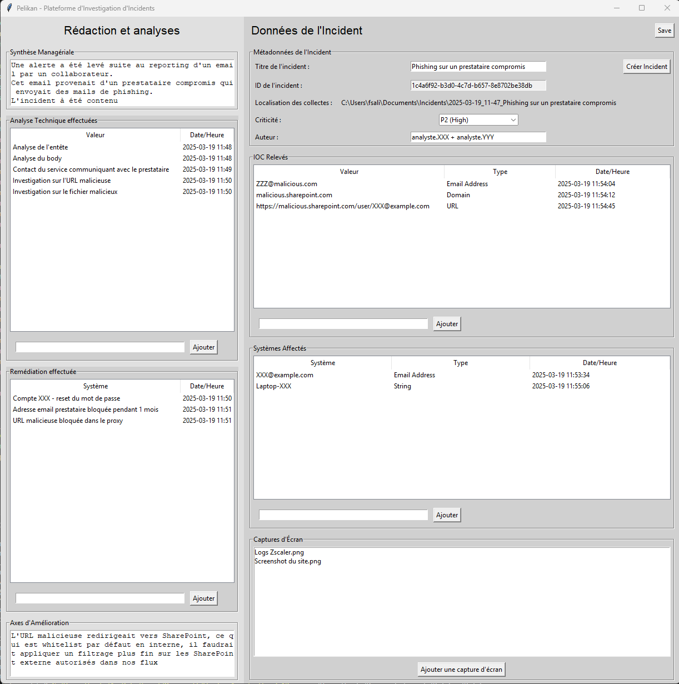

# Pelikan
Pelikan is a tool that aim at making the reporting of security incident easy

# Installation
You just have to launch the exe as it is portable.
But if you want to be sure of what you're using, you can always use pyinstaller on main.py with the setup file to make the portable exe yourself.

# Usage
This tool allows you to take notes during a cybersecurity incident.
It's based on the NIST SP800-61 : Computer Security Incident Handling Guide
The GUI is divided in 2 frames (left/right) where the left part allow you to enter text for : 
- The executive summary
- The technical analysis
- The remediations done
- The ameliorations axis that you identified
The right part is where the magic really is : 
- Lots of metadata, ,ostly generated automatically, but is editable if you want to tune the results
- Allow you to create or open an already existing incident
- Has 2 tables : 
  - One for IOC
  - One for affected systems
- A type recognition algo, you just put the string in it and it guess what it is
- A logging function, so you know the exact time you registered an IOC/Affected System and so, the exact time of identification of the IOC by your team
- a space to log screenshots, rename them and store them.

There is a config file name config.py that contains some variables that you can adjust like the default folder for creating an incident, ...

All theses things are just open door to what you can do with them.

# The future of the tool
For the futur updates of the tool, I have planned : 
- More types for the detection of IOC/Systems
- being able to choose the location where you want to create an incident
- Make it more "responsive" so you can work with all kind of screen resolution
- Rearrange some spaces
- Allow it to quick export the data in a .md inside the clipboard for quick send between team/N+1/...
- Make an export to docx button, as docx are the most used document format when it comes to reporting, and the yusually have all thoses "Graphic Charts", ..., being able to import the notes inside of a template would greatly accelerate the reporting of the tool.
- Change the widget type of Technical Analysis and Remediation into a table like the one for IOC and affected systems
- Add a playbook following guide and best practice for specific uses cases (Phishing, ...) that is customizable by the user in the config files
